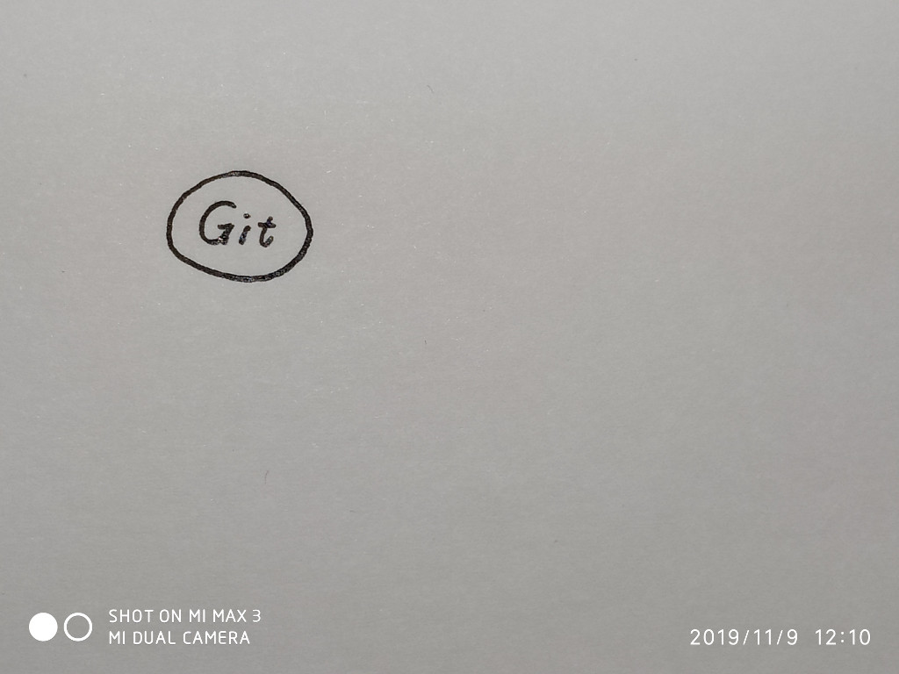
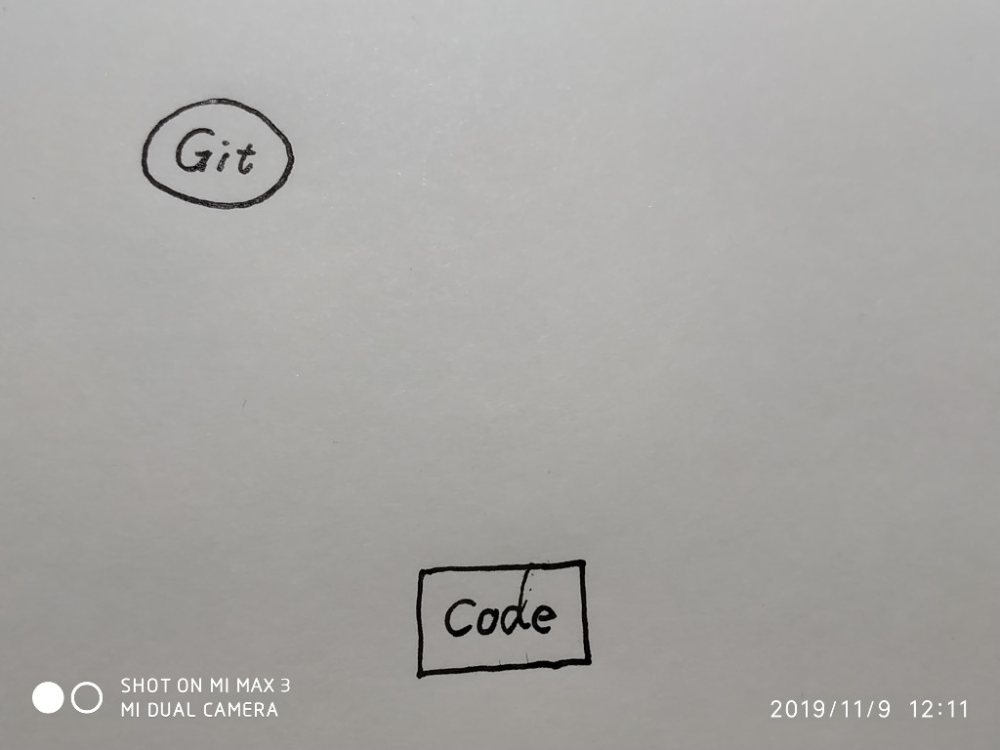
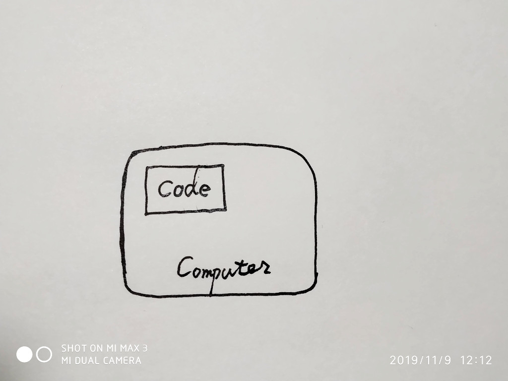
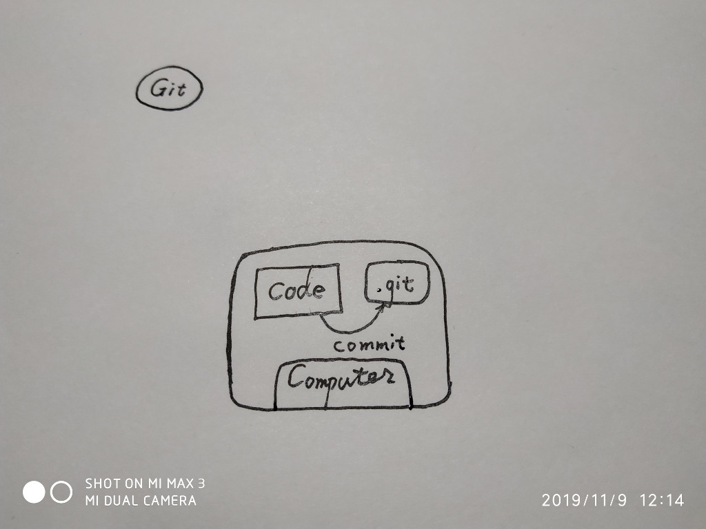
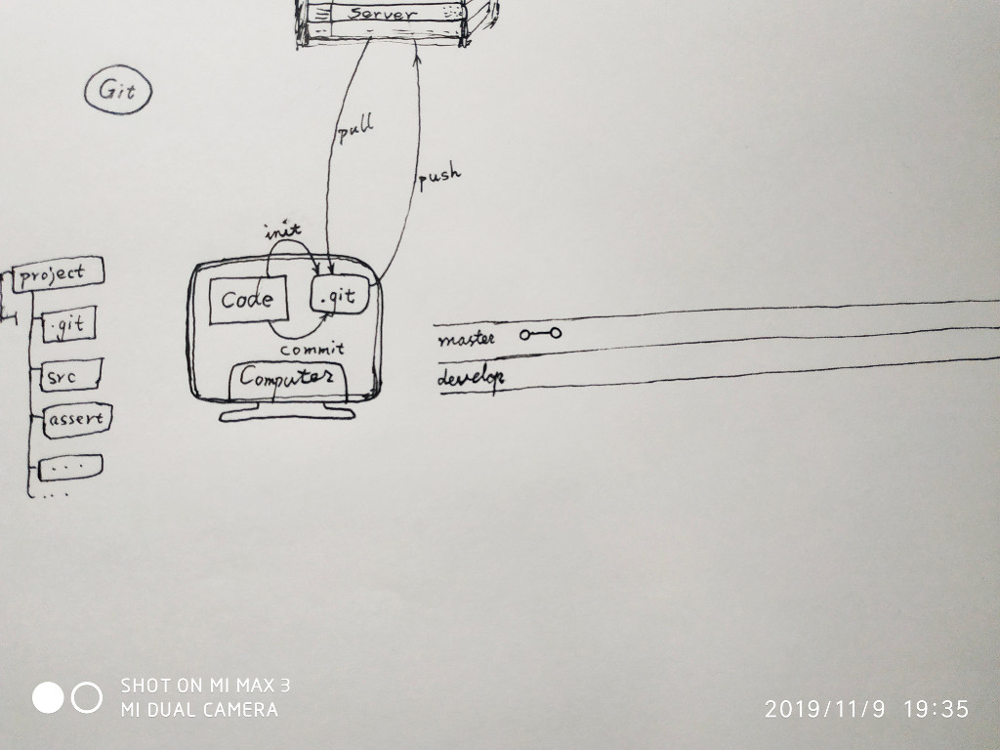
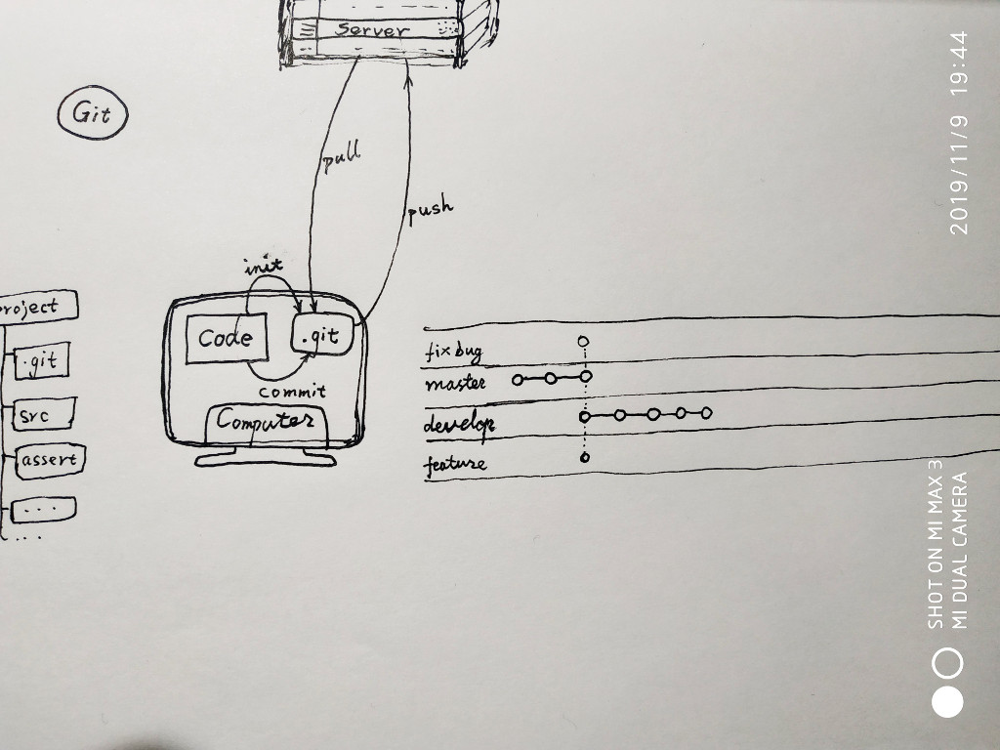
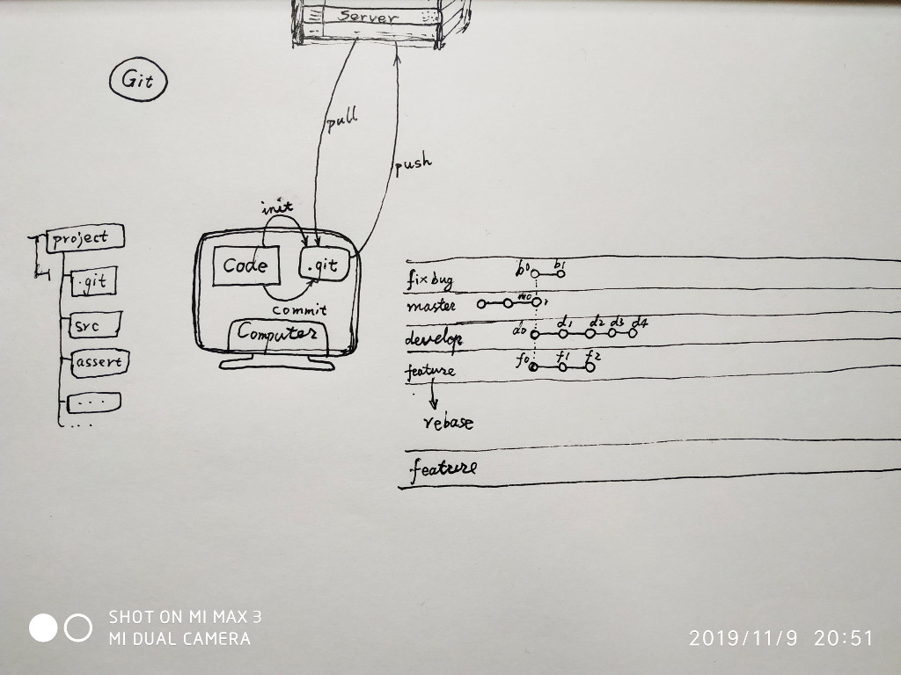
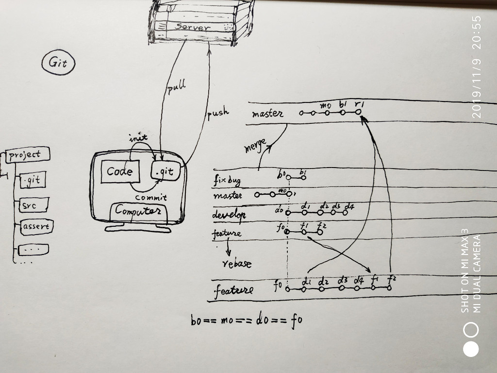

# 第四课 代码库

## 代码或文档要怎么保存和管理呢？

接下来先不着急上手编程，我们先要学一些保存代码和管理代码的方法。

- [Git 教程](https://www.liaoxuefeng.com/wiki/896043488029600)

## 说说 Git

## Git 保存 Code

## Code 在电脑里

## Code 添加 .git 目录

## 远处有 Server

## 文件目录如此

## 通过 pull 获取，push 推送

## master分支 develop分支

## 每次 commit 就是一个节点

## 新建的分支节点相同

## 各个分支 commit 互不影响

## merge 和 rebase

